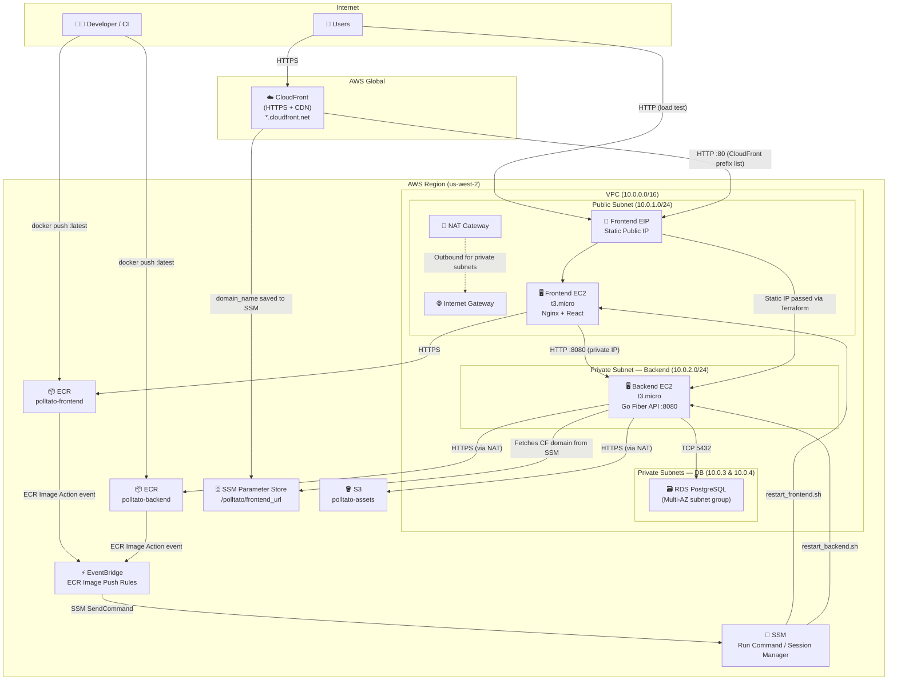

# Polltato — AWS Infrastructure Design

## Architecture Overview

The infrastructure is built on AWS using Terraform and follows a **layered VPC security model** with a CloudFront CDN layer in front. Two EC2 instances run Docker containers behind separate security groups: the frontend in a public subnet and the backend in a private subnet. Container updates are fully automated via an event-driven pipeline (ECR push → EventBridge → SSM), requiring no SSH access.

---

## Architecture Diagram



---

## Component Breakdown

### Networking (`vpc.tf`)

| Resource | CIDR | Purpose |
|---|---|---|
| VPC | `10.0.0.0/16` | Isolated network boundary |
| Public Subnet A | `10.0.1.0/24` | Frontend EC2 + NAT Gateway |
| Private Subnet — Backend | `10.0.2.0/24` | Backend EC2 (no public IP) |
| Private Subnet — DB A | `10.0.3.0/24` | RDS (AZ-a) |
| Private Subnet — DB B | `10.0.4.0/24` | RDS (AZ-b, required for RDS subnet group) |
| Internet Gateway | — | Public internet access for public subnet |
| NAT Gateway | — | Private subnets can reach ECR/S3/SSM outbound |

### Compute (`compute.tf`)

| Instance | Subnet | Public IP | Role |
|---|---|---|---|
| `polltato-frontend` | Public | ✅ Static EIP | Serves React SPA + proxies `/api/*` and `/socket.io/*` to backend |
| `polltato-backend` | Private | ❌ No | Runs Go Fiber API on port `:8080` |

Both instances run Docker containers pulled from ECR. The init scripts (`init_frontend.sh.tpl`, `init_backend.sh.tpl`) run on first boot and write persistent `restart_*.sh` scripts to disk.

### CDN (`cloudfront.tf`)

| Setting | Value |
|---|---|
| Origin | `aws_instance.frontend.public_dns` (Public DNS — required by CloudFront) |
| Price Class | `PriceClass_100` (US, Canada, Europe) |
| HTTPS | `redirect-to-https` via free `*.cloudfront.net` certificate |
| Caching | TTL=0 for all routes (dynamic app, cache disabled) |
| `/api/*` | All headers forwarded (auth tokens, etc.) |
| `/socket.io/*` | `Upgrade` + `Connection` headers forwarded for WebSocket |

> **Why Public DNS?** CloudFront edge nodes are global and cannot reach your private VPC. The origin must be publicly resolvable — `public_dns` is correct.

### Security Groups (`security.tf`)

| Group | Inbound | Purpose |
|---|---|---|
| `frontend-sg` | `:80` from CloudFront Managed Prefix List | CDN origin traffic |
| `frontend-sg` | `:80` from `0.0.0.0/0` | Direct access for load testing |
| `frontend-sg` | `:22` from `0.0.0.0/0` | SSH admin |
| `backend-sg` | `:8080` from `frontend-sg` only | API requests from frontend |
| `database-sg` | `:5432` from `backend-sg` only | DB access from backend |

### Database (`database.tf`)

- **Engine**: PostgreSQL on RDS
- **Subnet Group**: Spans `private_db_a` and `private_db_b` (two AZs required by AWS)
- **Access**: Only reachable from the backend security group

### Storage (`s3.tf`)

- **Bucket**: `polltato-assets`
- **Access**: Backend EC2 IAM role has `s3:PutObject`, `s3:GetObject`, `s3:DeleteObject`, `s3:ListBucket` on the bucket

### IAM (`iam.tf`)

| Entity | Role / Policy | Purpose |
|---|---|---|
| EC2 instances | `AmazonEC2ContainerRegistryReadOnly` | Pull images from ECR |
| EC2 instances | `AmazonSSMManagedInstanceCore` | SSM Session Manager (no SSH) |
| EC2 instances | Custom S3 policy | Read/write to S3 assets bucket |
| CI user | Custom ECR push policy | `docker push` from developer machine |
| EventBridge | Custom `ssm:SendCommand` policy | Trigger container restarts |

### Automated Deployment (`eventbridge_ssm.tf`)

The deployment pipeline is **fully automated** — no SSH required after `terraform apply`.

```
Developer: docker push :latest to ECR
  → ECR emits "ECR Image Action" (PUSH, SUCCESS, :latest) event
    → EventBridge rule matches
      → EventBridge calls SSM SendCommand
        → SSM runs restart_frontend.sh / restart_backend.sh on the EC2
          → Script pulls new image, stops old container, starts new one
```

The restart scripts are baked into the EC2 at boot time via `user_data`. They:
1. Authenticate to ECR via `aws ecr get-login-password`
2. Pull `:latest` image
3. Fetch CloudFront URL from **SSM Parameter Store**
4. Use the **Static Frontend IP** passed directly via Terraform template variables
5. Start the container with env vars including `CORS_ORIGIN`

| Parameter | Value | Consumer |
|---|---|---|
| `/polltato/frontend_url` | CloudFront domain name | Backend (for `CORS_ORIGIN`) |

> **Note**: The Frontend IP is now a static Elastic IP (EIP). Its value is passed directly to the backend as a template variable, removing the need for an SSM parameter for the IP itself.

---

## CORS Design

The backend accepts requests from both the CloudFront domain and the direct EC2 IP. This supports:
- **Normal traffic**: Users accessing via CloudFront (HTTPS)
- **Load testing**: Requests sent directly to the EC2 public IP (HTTP) for performance comparison

`CORS_ORIGIN` is set at container start time by `restart_backend.sh`:
```
https://<cloudfront-domain>,http://<static-frontend-eip>
```

---

## Load Testing

Two k6 scripts are provided in `load-test/`:

| Script | Target | Load Zone |
|---|---|---|
| `script.js` | CloudFront URL | Singapore |
| `front_end_script.js` | EC2 direct IP | Sydney |

Both scripts use **browser-mode k6** to simulate a real user loading a poll page and verifying the QR code renders.
